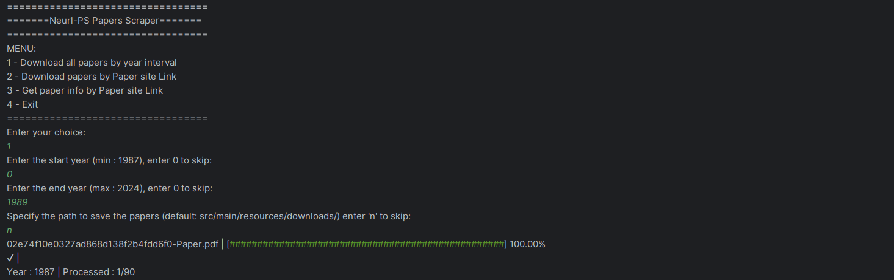
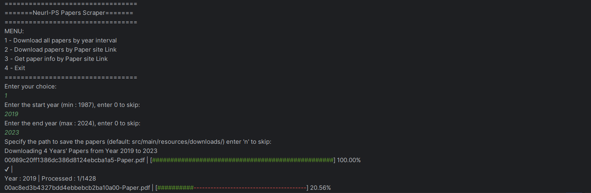

# Neurl-PS-Scraper

**A Java-based CLI tool to scrape NeurIPS papers effortlessly.**
>## Overview

Neurl-PS-Scraper is a command-line application designed to help you fetch and manage papers from the NeurIPS conference with ease. Whether you're a researcher, student, or enthusiast, this tool simplifies the process of gathering the latest research papers.

>## Features

- #### **📚 Efficient Scraping:**
    - Quickly fetch paper metadata and PDFs.
- #### **♻ Progress Tracking:**
    - Monitor the scraping process in real-time.
- #### **📑 Metadata Storage:**
    - Save and manage paper details for future reference.

>## Installation (Using Maven)

1. **Clone the Repository:**

   ```bash
   git clone https://github.com/Anas-Altaf/Neurl-PS-Scraper_java.git
   cd Neurl-PS-Scraper
   ```

2. **Build with Maven:**

   ```bash
   mvn clean install
   ```

3. **Run the CLI Application:**

   ```bash
   java -jar target/NeurlPS-Scraper.jar
   ```

>## Installation (Manually Adding JAR to IntelliJ IDEA)

1. **Download the JAR File (Jsoup)** (or build it using Maven as mentioned above).
2. **Open IntelliJ IDEA** and create a new Java project.
3. **Add the JAR to the Project:**
    - Go to `File` > `Project Structure` > `Libraries`.
    - Click `+` and select the Jsoup JAR file.
    - Apply changes.
4. **Run the CLI Application from IntelliJ:**
    - Create a new `Run Configuration` for a Java Application.
    - Set the Main Class (`Main` or appropriate entry point).
    - Run the project.

>## Usage

1. **Run the CLI Application:**

   ```bash
   java -jar target/NeurlPS-Scraper.jar
   ```

2. **Using the CLI:**
    - **Search Papers:** Enter your query to find relevant NeurIPS papers.
    - **Download Papers:** Select and download PDFs to your local machine.
    - **View Metadata:** Access detailed information about each paper.

>## Video

*(Placeholder for Video)*

>## Screenshots


*The main interface of Neurl-PS-Scraper.*

*Downloading the papers.*

>## Contributing

Contributions are welcome! Feel free to fork this repository, make improvements, and submit a pull request.

>## License

This project is licensed under the MIT License.

